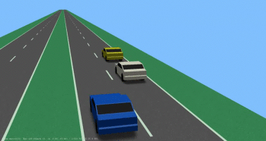
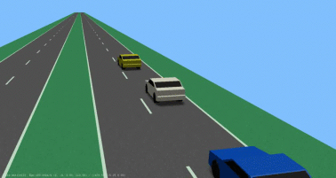
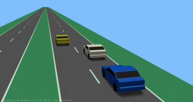
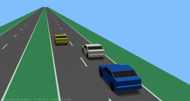
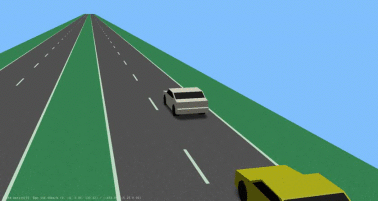
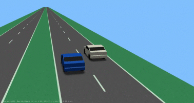
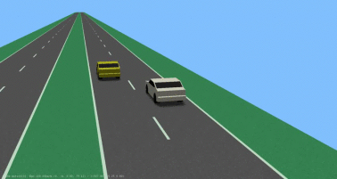

| Scenario name  | Description |  Preview | 
| ------------- | ------------- | --------- |
| [2-forwarding-ego-right-f-left-p-right](\scenarios\2lanes\2-forwarding-ego-right\2-forwarding-ego-right-f-left-p-right.xosc)  | Basic cut-in with interactive controller  |    | 
| [2-forwarding-ego-right-f-p-right-p-cutout](\scenarios\2lanes\2-forwarding-ego-right\2-forwarding-ego-right-f-p-right-p-cutout.xosc)  | Basic cut-in with interactive controller  |    | 
| [2-forwarding-ego-right-f-right-cutin](\scenarios\2lanes\2-forwarding-ego-right\2-forwarding-ego-right-f-right-cutin.xosc)  | Basic cut-in with interactive controller  |    | 
| [2-forwarding-ego-right-f-right-f-cutout](\scenarios\2lanes\2-forwarding-ego-right\2-forwarding-ego-right-f-right-f-cutout.xosc)  | Basic cut-in with interactive controller  |    | 
| [2-forwarding-ego-right-overtaken-f-right](\scenarios\2lanes\2-forwarding-ego-right\2-forwarding-ego-right-overtaken-f-right.xosc)  | ego-vehicle drives on the right lane with a following vehicle while being overtaken  |    | 
| [2-forwarding-ego-right-overtaken](\scenarios\2lanes\2-forwarding-ego-right\2-forwarding-ego-right-overtaken.xosc)  | Basic cut-in with interactive controller  |    | 
| [2-forwarding-ego-right-p-left](\scenarios\2lanes\2-forwarding-ego-right\2-forwarding-ego-right-p-left.xosc)  | Basic cut-in with interactive controller  |    | 

[level up](../)

[back to main](/)

