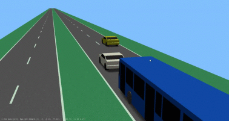
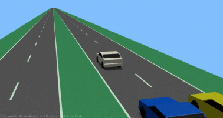
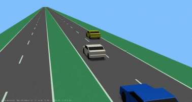
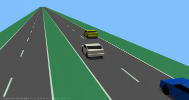
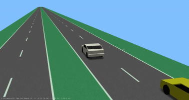
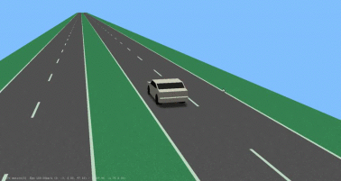
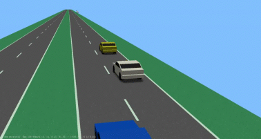
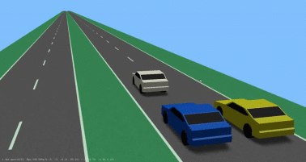

| Scenario name  | Description |  Preview | 
| ------------- | ------------- | --------- |
| [2-lanechange-ego-left-f-left-f-right-p-right](\scenarios\2lanes\2-lanechange\2-lanechange-ego-left-f-left-f-right-p-right.xosc)  | Basic cut-in with interactive controller  |    | 
| [2-lanechange-ego-left-f-left-f-right](\scenarios\2lanes\2-lanechange\2-lanechange-ego-left-f-left-f-right.xosc)  |   |    | 
| [2-lanechange-ego-left-f-left-p-right](\scenarios\2lanes\2-lanechange\2-lanechange-ego-left-f-left-p-right.xosc)  | Basic cut-in with interactive controller  |    | 
| [2-lanechange-ego-left-f-right-p-right](\scenarios\2lanes\2-lanechange\2-lanechange-ego-left-f-right-p-right.xosc)  | Basic cut-in with interactive controller  |    | 
| [2-lanechange-ego-left-f-right](\scenarios\2lanes\2-lanechange\2-lanechange-ego-left-f-right.xosc)  | Basic cut-in with interactive controller  |    | 
| [2-lanechange-ego-left](\scenarios\2lanes\2-lanechange\2-lanechange-ego-left.xosc)  | Basic cut-in with interactive controller  |    | 
| [2-lanechange-ego-right-f-left-p-right](\scenarios\2lanes\2-lanechange\2-lanechange-ego-right-f-left-p-right.xosc)  | Basic cut-in with interactive controller  |    | 
| [2-lanechange-ego-right-p-left-p-right](\scenarios\2lanes\2-lanechange\2-lanechange-ego-right-p-left-p-right.xosc)  | Basic cut-in with interactive controller  |    | 

# Simulation

To run a scenario in a simulator the following files need to be downloaded and placed into the the same folder as the scenario: [Catalogs](/Catalogs)

[level up](../)

[back to main](/)

